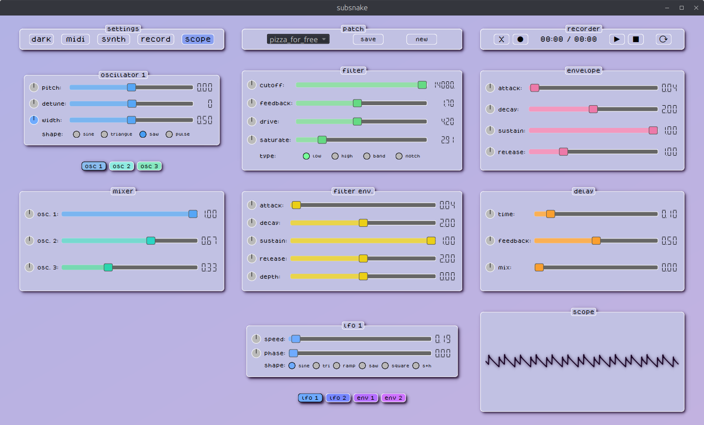

# subsnake

subsnake is a polyphonic virtual analog subtractive synthesizer, written in python.

what does it do? well, i'm so very glad you asked.
* it makes sound (yay!)
* it has 12 voices
* it supports midi (input)
* it can save & load patches

ok. sounds neat. what's in a voice?
* 3 sine, polyblep (anti-aliased) sawtooth or pulse generators (+ PWM)
* 1 state-variable filter - using an oversampled Chamberlin topology with feedback, saturation & drive
* 2 ADSR envelopes - one for amplitude, one for filter frequency, using leaky integrators
* 4 modulators - 2 LFOs, 2 AR envelopes, with dedicated assignable attenuverters for every parameter
    * shapes: sine, triangle, ramp, sawtooth, square, sample & hold | 0.01-10Hz w/ controllable phase shift
    * modes: attack-release, attack-hold-release, loop (attack-release) | .01-1s per stage

there's also a stereo delay on the master bus (voice output + recorder), and a stereo audio recorder/looper with continuous overdubbing.

what's the midi like?
* it supports device & channel selection, with note-on velocity (linear curve)
* cc's can be added & removed, and freely assigned to control any parameter
    * parameter updates are reflected visually, so the sliders & displays remain in sync with cc's
* gate on/off events use sample-accurate timing (works well with sequencers)

how's the modulation?
* every parameter has a dedicated bipolar modulation control (the small knobs left of each slider)
* *right clicking* a knob changes the assigned modulator (and color)
    * none (disconnected) -> lfo1 -> lfo2 -> menv1 -> menv2 -> back to none
* *left clicking* a knob and dragging up/down will increase/decrease the modulation amount
* *double clicking* any knob will reset the modulation amount to 0.0 (centered)

is there anything else?
* to reset a parameter, double click the parameter display (to the right of each slider)
* the keys A-' are mapped chromatically and can trigger note events (fixed velocity)
    * you can shift the pc keyboard octave range up/down using the +/- keys

ok. sweet. how can i play it?
* since there's no package (yet), you'll need to run it in a python virtual environment. open a terminal (on linux) and do the following:
    * you'll need to install python first, along with pip (usually included - check by typing `pip`)
    * download (or clone) this repo, and point your terminal to the folder
    * type `python -m venv ./.venv`, to create the environment
    * next, type `source ./.venv/bin/activate` - you should now see `.venv` before your command prompt
    * now, type `pip install -r requirements.txt` - this will install the libraries you need to run it
        * PySide6 (Qt) for the GUI
        * sounddevice for audio output
        * numpy/numba for DSP
        * python-rtmidi for midi
        * mido for midi parsing
    * finally, navigate to the project directory and type: `python ./main.py` - and away you shall go

what's on the docket?
* save & auto-restore midi settings on load (channel, cc's, parameter mappings)
* configurable velocity for PC keyboard note events (currently fixed at 127)
* recorder settings panel
    * interface for fine tuning loop start/end points
    * allow saving of recorder buffer to (wav) file
* synth settings panel
    * configurable oscillator drift
    * filter key tracking amount
    * voice stacking & spread
* stereo delay
    * connect mod dials for parameter modulation
    * add delay parameters as cc destinations
    * add ping pong & dampening parameters
* allow UI theming, saving/loading of themes & add stock themes (dark mode pending)
* themeable oscilloscope display
* more "factory" patches

if you encounter any issues, let me know with an issue report. otherwise, have fun! ^w^

