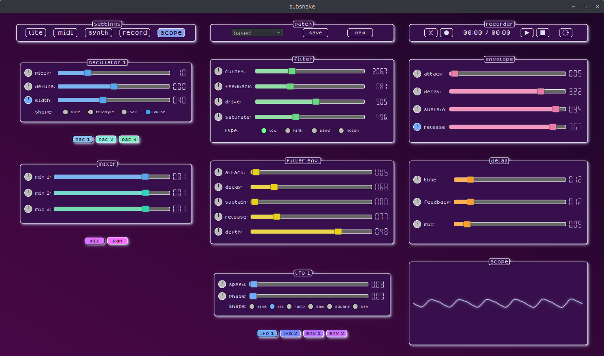

# subsnake

subsnake is a polyphonic virtual analog subtractive synthesizer, written in python.

### what does it do?
well, i'm very glad you asked.
* it has 16 voices of polyphony
* it supports midi (input)
* it can save & load patches
* it can record, overdub, play, loop, & save audio
* it can make a fine espresso

### what's in a voice?
* 3 sine, triangle (+ PWM), sawtooth, or pulse (+ PWM) oscillators with pitch, detune & level controls
* 1 state-variable filter - using an oversampled Chamberlin topology with feedback, saturation & drive
* 2 ADSR envelopes - one for amplitude, one for filter frequency (with bipolar depth control)
* 4 modulators - 2 LFOs, 2 envelopes, with dedicated assignable attenuverters for every₁ parameter
    * LFO shapes: sine, triangle, ramp, sawtooth, square, sample & hold
        * 0.01-10Hz w/ controllable phase shift
    * env. modes: attack-release, attack-hold-release, loop (attack-release)
        * .01-1s per stage
    * __₁__ *slider-controlled (excludes radio buttons)*

there's also a stereo tape delay effect on the master bus (voice output + recorder), and a stereo audio recorder/looper with continuous overdubbing.

### what's the midi like?
* it supports device & channel selection, with note-on velocity (linear curve)
* cc's can be added & removed, and freely assigned to control any parameter
    * parameter updates are reflected visually, so the sliders & displays remain in sync with cc's
* gate on/off events use sample-accurate timing (works well with sequencers)

### how's the modulation?
* every parameter has a dedicated bipolar modulation control (the small knobs left of each slider)
* *right clicking* a knob changes the assigned modulator (and color)
    * none (disconnected) -> lfo1 -> lfo2 -> menv1 -> menv2 -> back to none
* *left clicking* a knob and dragging up/down will increase/decrease the modulation amount
* *double clicking* any knob will reset the modulation amount to 0.0 (centered)

### is there anything else?
* to reset a parameter, *double click* the parameter display (to the right of each slider)
* the keys A-' are mapped chromatically and can trigger note events (fixed velocity)
    * you can shift the pc keyboard octave range up/down using the +/- keys
* to switch between oscillator types (BLIT/polyBLEP), *right click* the oscillator title box
    * currently only applies to sawtooth & pulse wave selections (triangle is BLIT-only; sine is a sine)
* changing the width of the triangle wave morphs the waveform from a sawtooth (w≈0.0), through a triangle (w=0.5), to a ramp (w≈1.0)

### how can i play it?
* [v0.2.3](https://github.com/rainbow-carrots/subsnake/releases/tag/v0.2.3) is the latest build
* click on the version that corresponds to your platform to download the zip, extract, & run! if it doesn't open:
    * __on linux__: right click the file, go to *Properties* -> *Permissions*, and make sure "Allow executing file as program" is checked 
    * __on macos__: you'll need to [authorize the app](https://support.apple.com/guide/mac-help/open-a-mac-app-from-an-unknown-developer-mh40616/mac) when running it for the first time. go to *System Settings* -> *Privacy & Security*, scroll down to the bottom, and choose *Open anyway* (under *Security*)
    * __on windows__: click *More info* on the smartscreen popup and choose *Run anyway* 
* **note**: this project is in active development. though i test every build prior to release, you may still encounter bugs.
    * if you do spot something, [let me know](https://github.com/rainbow-carrots/subsnake/issues)

### what's on the docket?
* save & auto-restore midi settings (channel, cc's, parameter mappings)
* recorder settings panel:
    * controls for adjusting loop start/end points
    * control to adjust input level
* synth settings panel:
    * pc keyboard velocity control
    * voice stacking & spread settings
* modulators:
    * shape-dependent secondary control (currently sets phase only)
        * phase for sine, saw & ramp
        * width for square & triangle
        * jitter for sample & hold
    * third LFO & modulation envelope
    * make LFOs anti-aliased
    * additional LFO modes:
        * reset phase on gate
        * key pitch tracking (w/ ratio)
    * increase max. LFO rate to audio range
    * add audio oscillators as mod sources
* effects:
    * stereo delay
        * ping pong & dampening parameters
    * stereo chorus
    * Schroeder reverb
    * combine effects into single stack
* pattern generator/sequencer
* combine oscillators into single stack
* allow UI theming & saving/loading of themes
* oscilloscope/Lissajous display
* more "factory" patches